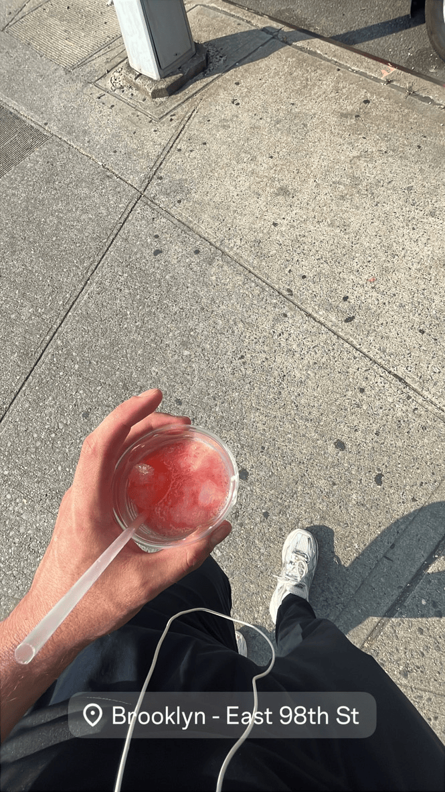

_Summer Notes from New York City, 2025_  
::spotify{url="https://open.spotify.com/episode/21TQ6KrqTpobNZxzk6xMV5?si=_6LF3ZoAQfmWssOUXUm-CQ"}

---

## ARRIVAL - THE FAMILIAR STRANGER

Nine hours in the air. My body tired, my mind restless. I wasn’t sure how the airport process would go this time with all the new border paranoia. You hear stories. People getting turned away for nothing.

But the CBP agent ends up asking me about my ankh necklace and my CS degree. We talk. He smiles. I walk through.
_That’s New York — chaos and grace, alternating every five minutes._

Then came the usual hiccup: my card didn’t work with the MTA system.
Three swipes later, I just bought myself a card instead (which I later lost), but my credit card started working by then.

But the excitement didn’t last. The second I stepped onto the train platform, everything just… normalized.
It wasn’t awe, or nostalgia, or adrenaline — it was something quieter.
Like my brain clicked into a familiar mode I didn’t know was still there.

The heat, the grime, the sound of the arriving train — none of it felt foreign.
_I wasn’t sightseeing. I was syncing._

By the time I sat down on the train toward Brooklyn, I wasn’t thinking about luggage or hotels anymore.
It felt like I’d done this a hundred times before — like this was home in a past life, and I’d just returned to clock back in.
Normality crept in fast. My thoughts went quiet.
Just me, the noise, and that strange peace that comes when a city stops performing for you.

::spotify{url="https://open.spotify.com/track/0i2koeuewzFaLuIlv16Ilf?si=8fee6fe72d8a4884"}

---

## BEFORE MY FLIGHT 

The trip started long before I landed.  
Weeks of messages bouncing across time zones — short, chaotic, perfectly New York.

> “What we doin?”  
> “Bring a speaker if we end up among our own party.”

Half joke, half prophecy.

That’s how the city moves — _orbits, not plans. Everything improvised._  
Even the smallest text carried something that I would describe as rhythm: confidence mixed with uncertainty, but never hesitation.  
This was exactly what I was craving — New York doesn’t ask for preparation, just presence.

Back home, people text like they’re filling out a form. Full sentences, polite punctuation, or even minute-long voice messages.  
Here, I got to experience messages that sound more like a dare and an invitation at the same time.  
_It’s fast, funny, unfiltered — and it makes you move before you overthink._

Those early DMs already had me in motion.  
I could feel the energy through the screen — looseness, confidence, and the sense of “just show up.”  
No detailed plan, no itinerary. Just flow.

> “Just bring yourself and the vibes.”  
> “Lmao that’s all I’m bringing anyway.” 

That’s when I knew: this trip wouldn’t be scheduled. It was going to be lived. Exactly what I needed and exactly what I craved.

---

## BUSHWICK - I AM BACK

Bushwick hit different this time.  
The air was heavy — like someone had left the oven open for the whole of Brooklyn.  
You step out of the train and the first thing you hear is the rumble from above — the M train screaming over rusted steel.

::youtube{url="https://www.youtube.com/watch?v=P3bclAI2_LI"}
::youtube{url="https://www.youtube.com/watch?v=HvRIdMeITk0&t=2s"}

Brick walls painted with saints, weed smoke, cars driving by playing music on ridiculously large sound systems.  
Someone arguing in Spanish, someone else laughing while getting out of the Planet Fitness.

I dragged my backpack up the sidewalk past the Bushwick Houses — block after block of the same brown buildings, all different in small ways.  
A kid zipped past me on a scooter, yelling lyrics to a song I half-knew from TikTok.  
A woman on her stoop nodded like she’d seen me before.  
That tiny nod grounded me more than any map could.

The hotel seemed to be newly remodeled. I believe it was a refugee home in previous years, so it was still very bare-bones.

Last time I visited, I stayed with an older Jamaican couple in Bed-Stuy. This time around, hotels might’ve been cheaper than Airbnbs — maybe because of the crackdown on short-term rentals and the housing shortage in the city.

I dropped my bag, opened the window, and just listened. Trains, voices, air conditioners fighting the heat.  
The sound of life — I felt part of it all.

::spotify{url="https://open.spotify.com/track/6iFWDDLAD2obmmEbmHfCDR?si=c77e344694d749fb"}

There’s this moment that always happens to me in this city:
I stop thinking and start syncing. I don’t chase the rhythm, I just surrender to it.

Somewhere between the noise, the sweat, and the smell, my brain shut off its constant overthinking and planning. I wasn’t visiting anymore. I was participating.

---

## PARKCHESTER - MEETING UP WITH INTERNET FRIENDS

The Bronx felt like another planet compared to Brooklyn — louder, looser, warmer.
I took the M into Manhattan, switched to the 6 train, and watched the skyline flatten into rows of apartment blocks — the kind you only ever see in music videos or movies like _A Bronx Tale._

That morning, I got told that my friend was off work, so in a matter of seconds, I decided to grab a beef patty in Bed-Stuy and then went on my way to Parkchester. No second thoughts, no plan. I just went.
When I got there, I waited a few minutes, then he picked me up on foot right by the Parkchester station. We walked through the whole complex, grabbed something from the deli, and made our way toward the Oval.

::youtube{url="https://www.youtube.com/watch?v=B_jkXBjU8I8&t"}

With no hesitation, I got invited into his parents’ apartment. His mom sleeping, the TV murmuring, windows open to the hum of traffic.
We talked for hours — about music, the city, traveling, how everyone in New York has a story running in the background.

> “Some people don’t have a lot of thoughts.  
> It’s a double-edged sword. You can stay blind and safe or notice everything and still move anyway.”

That line hit harder than he probably meant it to.  
It summed up the entire city — people surviving not by ignoring chaos, but by learning to walk through it with their eyes open.

Later that day, his friend came over as well.  
In the evening, we went outside: kids playing, old men talking over music. Every corner felt like someone’s living room.  
I realized that trust here doesn’t come from knowing people long — it comes from how you carry yourself.  
A quiet “how are you?” can mean protection, not suspicion.  
It’s a different kind of safety — one built on presence, not comfort.

When I left, the sound of the trains followed me — that deep metallic hum fading in and out as the city blurred past the window, carrying me back to Brooklyn.
It was my first time setting foot in the Bronx. I’d heard all the secondhand warnings — mostly from people who spend their lives south of Central Park, talking like they know the city from headlines and hearsay.
So yeah, I was alert, watching faces, reading the room at every stop.
There’s a certain tension you feel in places like that — _not danger exactly, just energy._
The kind that reminds you everyone’s navigating their own version of survival.
Being in my early twenties, I’m aware that’s the age where things can go left fast if you’re not tuned in.
But nothing did. The ride was quiet, almost cinematic — the kind of stillness that makes you reflect instead of react.
It taught me something simple: _stay sharp, but don’t hide from experience._
If you let fear dictate where you go, you’ll never see the real city.

---

## DOMINICAN BARBERSHOP - LANGUAGE BARRIER

::youtube{url="https://www.youtube.com/watch?v=tftMdoCRvrE"}

I’d booked a haircut with the owner of a Dominican barbershop a few blocks from my hotel.  
Inside, the shop was warm and bright — chrome mirrors and white tiles, the smell of aftershave and fading hair dye.  
The barber barely spoke English, and I didn’t speak Spanish at all.  
So I did what everyone else does — showed him a picture.  
He just nodded and said, “I got u.”

For the next forty minutes, it was all rhythm — clippers buzzing, dembow pulsing underneath.  
No small talk, just a few “OK?”  
He lined me up, fucked up my mustache into a pencil line, and made my eyebrows crisp.  

I stepped outside, and the night felt sharper — the music louder, the colors brighter.
I haven’t had a professional haircut since my 12th birthday, I think.
A couple of guys nodded at me like they’d been watching the whole process.
I knew I was ready for the Dominican parade.
That’s the city’s language: _short, effortless acknowledgments that somehow mean everything._

By then I’d stopped overanalyzing everything. I felt even less like a tourist than before.
Just another person in motion — lined up, grounded, and quietly blending in.

---

## GRAND CONCOURSE - DOMINICAN DAY PARADE

I caught the 6 train up to the Concourse and walked until Grand Concourse / Mount Eden Ave — already running late.
By the time I surfaced near the Concourse, the air was already shaking.

::youtube{url="https://www.youtube.com/watch?v=XZhPh0XV45Q&t"}

Music bleeding from every direction — dembow, bachata, drill, all in the same key.
Vendors flipping pastelitos on oil-stained grills, smoke mixing with perfume and exhaust.
The Dominican Day Parade isn’t an event you watch — it’s an atmosphere you get swallowed by.
The streets were alive: kids on scooters, women dancing, men waving flags out of cars.
You could feel the pride and history. Everyone was part of the soundtrack.

Even though I wasn’t Dominican (even though I always get talked to in Spanish, even outside the Bronx), nobody cared.
People kept pulling me into photos, dapping me up, offering food.
When the sun started dipping behind the buildings, the crowd didn’t slow down.
I saw Eric Adams taking a group picture with some Trinitarios.
There was a shooting or two, but all that negativity didn’t affect the good energy.
People kept on living and enjoying their day.
The heat softened, the lights came out, and the music switched to smoother cuts — Romeo Santos, Aventura — while the side blocks blasted their local drill rappers.
The whole borough glowed red, white, and blue under the sunset.

Before taking the train back, I took a stroll all the way down to Mott Haven and went back to Brooklyn from there.
I had to see more of the Bronx before heading home.
Before getting on the train, I bought a homeless guy some food from the deli around Melrose and went on my way.

---

## BROOKLINE DAY — INSIDE A DAY THAT WASN’T MINE

::link{url="https://en.wikipedia.org/wiki/Breukelen_Houses"}

I took the train deep into Brooklyn that morning, past the places most tourists stop calling “Brooklyn.”
I was heading to Breukelen “Brookline” Day in Canarsie / ENY — an event that felt half block party, half reunion, half warning not to get too curious if you didn’t belong.
I walked from my stop near Canarsie all the way to the Breukelen Houses. The closer I got, the louder it became — bass lines bouncing off brick walls, kids running through the playground, people handing out flyers and drinks from coolers.
Many wore anti–gun violence T-shirts. You could tell the message was for the kids — not a speech, but a vibe. A day to show them something different.

Local artists were already setting up to perform on a small stage, and the crowd filled every inch of space. Before settling in, I walked through an industrial stretch toward Pennsylvania Avenue — long, empty roads and the smell of hot metal in the air. NYCHA buildings rose in the distance, block after block of brick stacked over stories I’ll never know.

Later, I leaned against a wall near the playground, sharing my lighter with a few people around my age — friends of one of the local drill groups that had just performed.

::youtube{url="https://www.youtube.com/watch?v=HaLrfrkt9YU"}

That’s when the contradiction hit instantly: it was an anti–gun violence event, but the performers were rapping diss tracks aimed at rival buildings just across the courtyard.
It didn’t add up at first, but maybe that’s because it wasn’t meant to.

_I believe this is a good video to watch to understand what I am trying to say here. Made by someone who is aquainted with that area._

::youtube{url="https://www.youtube.com/watch?v=lNTufKSTgmo&t"}

There are layers here — things tied to history, pride, grief, and survival — that don’t translate cleanly.
I realized how easy it is to come in with logic, but how little logic applies when pain and art are the same language.

Andrew Cuomo showed up briefly — shook hands, smiled for a few pictures, and left for another Hood Day uptown. It felt staged, like fast-food politics. But nobody here needed that validation. They weren’t performing for him or for social media. They were just being — raw, joyful, alert.

New York’s pulse doesn’t come from the skyline.
It comes from neighborhoods like this — places that keep the city honest, even when that honesty is uncomfortable.
When I left, I didn’t feel like an outsider exactly — more like a guest who got to see something real for a moment, and knew better than to claim it.

---

## QUEENS - JAMAICA, FAR ROCKAWAY, FLUSHING, ELMHURST AND LONG ISLAND CITY

_Just some images because Queens is too big to summarize in words._

## BROWNSVILLE - STREET VENDORS

_I bought a drink off jamaican street vendors and we talked for a bit about life in Brooklyn._

## FLATBUSH - I GOT CALLED PAPA

_Most conversations with strangers I have had, while also being stared down the most._

::youtube{url="https://www.youtube.com/watch?v=2b9QFg0v0OI"}

## WILLIAMSBURG - THE LA OF BROOKLYN

## SUNSET PARK - LATINO CULTURE AND VIEWS

## CONEY ISLAND - BASKETBALL, PARTIES AND SEAGULLS

## DUMBO & BROOKLYN HEIGHTS - OVERPRICED FOOD AND LATE NIGHT REFLECTION

_Where I spent my all-nighter during my last hours in NYC._

## HARLEM - 125TH, STEPS AND BEEF PATTIES

_Exploring Harlem for the fist time, getting beef patties and walking around 125th street and more._

## BACK HOME - WILL I EVER FULLY LEAVE?

Leaving New York always feels like stepping off a moving treadmill — your body’s still running even when everything around you stops.  
The flight home was quiet.  
I scrolled through photos I didn’t remember taking — train windows, deli lights, the blur of faces.  
Every image felt louder than the cabin around me.

Back in Germany, things are still. Streets too clean, conversations too formal.  
People say “how are you” but don’t mean “are you good.”  
My rhythm’s off — I catch myself walking too fast, checking for trains that don’t come every two minutes.  
Even my playlists sound different.  
I still text the people I met. Short, random, mid-day messages — memes, music, voice notes.  
The tone hasn’t changed. Same rhythm, same jokes.  
It’s like New York exists in my notifications now. One message reads:

> “Outside any chance we get.”  
> “You a New Yorker now.”

Maybe that’s what travel really is — not distance, just different time zones for the same connection.
I didn’t leave the city completely; it’s still running in the background, like an app that never really closes.

---

