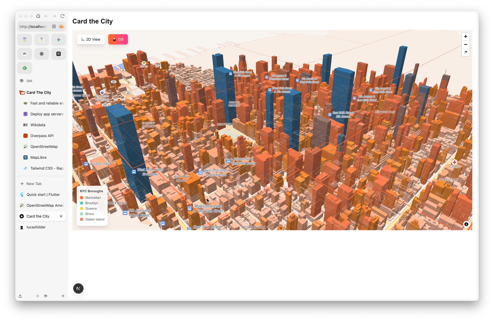

_Card the City is a **Transferprojekt** for my class that I started on September 25th, 2024. The project explores urban anthropology through creative technology, transforming neighborhood data into persona-based trading cards._

## Project Concept

The core idea is to analyze neighborhood characteristics using real urban data and generate unique "persona cards" that capture each area's vibe and identity. Think of it as turning city exploration into a collectible card game.

## What I'm Building

The project involves several key components:

- **Interactive neighborhood mapping** with real-time data from OpenStreetMap
- **Persona generation system** that analyzes POI data to create neighborhood archetypes
- **Trading card interface** for visualizing neighborhood personalities
- **Data-driven insights** about urban patterns and local culture

## Technical Approach

I'm following a structured development process with clear phases:

- **Phase 1**: Foundation setup with Next.js and mapping functionality
- **Phase 2**: OpenStreetMap integration via Overpass API
  

- **Phase 3**: Persona generation algorithm and card UI
- **Phase 4**: Interactive features and sharing capabilities
- **Phase 5**: Polish and optional extensions

## Goals

This project combines my interests in urban studies and web development while meeting academic requirements for demonstrating software engineering practices, API integration, and user experience design.

The project will be fully documented with a focus on architecture, implementation challenges, and real-world data integration.
