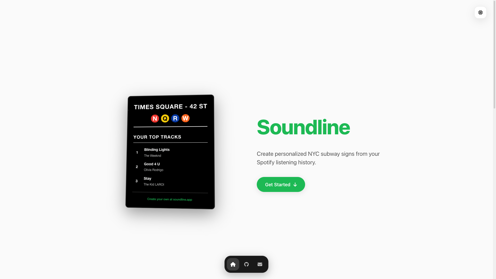

_Soundline is a creative web application that bridges music and urban design by transforming personal Spotify listening data into authentic NYC subway-style signs._

## The Concept

The idea was to take something as personal as your music taste and present it through the lens of New York City's iconic subway signage. Users could connect their Spotify account and see their top tracks, artists, and listening habits displayed as if they were stops on the subway map.

## Technical Implementation

- **React frontend** for interactive user interface
- **Spotify Web API** integration for music data
- **Custom CSS styling** to replicate subway sign aesthetics
- **Real-time data processing** to generate personalized signs

## Challenges & Discontinuation

The project faced significant obstacles when Spotify updated their Developer API policies, requiring manual whitelisting of users instead of open access. This change made the application impractical for public use and ultimately led to the project's archival.

Despite its discontinuation, Soundline represents my interest in creative data visualization and finding unexpected ways to present familiar information.
